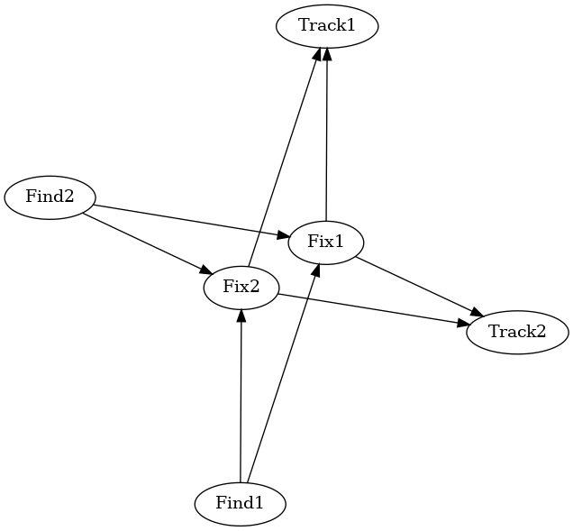

Building a Basic Killweb
########################

A killweb is best understood as a series of interconnected systems and components which work together to complete a mission. 
This concept is the evolution of the kill chain which is a single, linear path of connected components that are used to complete 
each task within a given mission. Killwebs aim to enhance mission planning by striving for joint capabilities that are more robust 
than a kill chain could offer.

Components
**********

Within the context of a graph, a component is simply another term for a node. However, in a mission, components are more complex.

Within the context of mission engineering, we define a component as "a collection of functionality compiled for a single capability". This may seem abstract, but missions require a variety of capabilities, and no two missions are the same.
During planning, it may just be useful to identify and connect available components, but advanced planning requires components to be more than just a name.
Each component is often dedicated to a single task dependant on the mission at hand. For example, one component might be tasked with finding a target, while another might be tasked with assessing a situation.
While not required for visualization, additional component capabilities and metrics require the definition of custom tasks, parameters to that task, and other components it is connected to. 

Constructing Killwebs via the Config File
*****************************************

Within MIMIK, a killweb is created by specifying the components in a JSON configuration (config) file. The 
config file consists of a series of component profiles keyed by each component's name. Again, these profiles include information on 
the component's custom tasks, parameters to that task, and other components it is connected to. 

The minimal example contains an example of a config file. In the :code:`mimik` repository, navigate to 
:code:`mimik/0_minimal_example/configs/` to view.

.. code-block:: JSON

    {
        "simple_killweb": {
            "Find1": {
                "connected_components": ["Fix1","Fix2"]
            },
            "Fix1": {
                "connected_components": ["Track1","Track2"]
            },
            "Track1": {
                "connected_components": []
            },
            "Find2": {
                "connected_components": ["Fix1","Fix2"]
            },
            "Fix2": {
                "connected_components": ["Track1","Track2"]
            },
            "Track2": {
                "connected_components": []
            }
        }
    }

In the minimal example, this simple killweb contains generic components that do not require input arguments nor utilize any particular custom task
but they do specify connected components using the key :code:`connected_components`, allowing the relationship between components to be stored as intended.

Creating a :code:`Killweb` object constructs the killweb upon instantiation by specifying the pathway of both a working directory to read tasks from and write outputs to and 
a valid written config file. The Killweb class is included in :code:`mimik`. Constructing a killweb using the config file would be written as follows:

.. code-block:: python
    
    from mimik.killweb import Killweb

    killweb = Killweb(working_dir="0_minimal_example/", config_file="0_minimal_example/configs/minimal_example.json")

Once the killweb with connected components is constructed, we can use :code:`Killweb` to perform a variety of tasks to visualize 
and simulate over it.

Visualizing the Component Graph
*******************************

The :code:`Killweb` object stores the component graph that can be visualized as a graph. One might do this first 
to verify components connect with its connected components correctly as intended. To view the killweb at a component level, 
a :code:`Killweb` can call :code:`create_component_networkx_visualization()` to visualize the killweb in its graph format.

After installing MIMIK, a simple script that accomplishes builds and visualizes a killweb might be written as such:

.. code-block:: python
    
    from mimik.killweb import Killweb

    if __name__ == "__main__":
        killweb = Killweb(
            working_dir="$PWD/mimik/0_minimal_example/"
            config_file="$PWD/mimik/0_minimal_example/configs/minimal_example.json"
        )
        killweb.create_component_networkx_visualization()

From running this script, you should expect to see the following image stored in :code:`0_minimal_example/output/`:

Based on the config file as input, MIMIK has illustrated the relationship of components involved in this mission.
Ensure that paths are correct from the current working directory from which the script is called. 