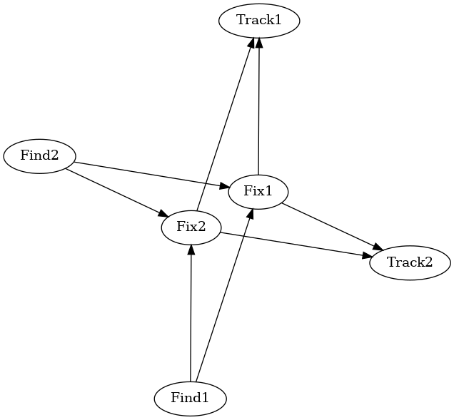

.. _quickstart: 

================
Quickstart Guide
================

Prerequisities
==============

Install MIMIK by following the :ref:`installation`

To test the system and environment are operational, run the main.py script with the following

.. code-block:: python

    python main.py

From running this script, you should expect to see the following image stored in :code:`mimik/0_minimal_example/output/`:

After this guide, one should be able to verify MIMIK is operating in working order. Additional MIMIK documentation will point to operating MIMIK in more complex cases as well as addressing the capabilities and metrics.